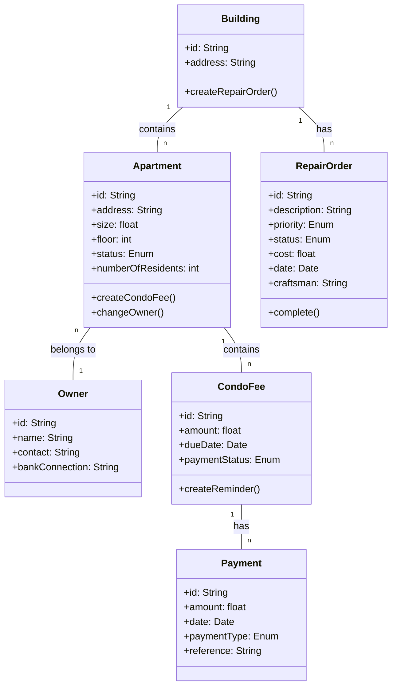

# Spec for REstateHub

## System-Prompt für Konzept

Du bist Softwarearchitekt und Spezialist für Verwaltungsanwendungen wie WEG's. Entwirf das Konzept für eine stark vereinfachte WEG-Verwaltung als eintägiges Lernprojekt.

Die Anwendung soll insbesondere abbilden:
- Hausgeld und Zahlungen
- Wohnungen und Eigentümer
- Reperaturaufträge
- Reparaturen/Instandhaltungen

Prüfe, ob diese Entitäten erstmal so Sinn ergeben. Unsere Architektur der Anwendung soll prozessgetrieben und wir wollen DDD, CQRS und Event-Sourcing berücksichtigen, wo es sinnvoll ist. Um die Komplexität der Anwendung im Rahmen zu halten, ist die Datenverwaltung für Wohnungen und Eigentümer simpel zu halten ohne Event-Sourcing. Aber als Softwarearchitekt und Spezialist für WEG-Verwaltung weißt du selber am besten, wie das zu gestalten ist. Lass uns das Konzept zunächst brainstormen. Bitte kein ausgearbeitetes Konzept im ersten Shot von dir sondern lass uns erstmal Schritt für Schritt die benötigten Prozesse ausarbeiten. Bitte keine Prosatexte sondern präzise stichpunktartige Antworten und Ideen. 

Bei Unklarheiten und Lücken frage stets nach.

# WEG-Verwaltung: MVP-Konzept

---

## **1. Kern-Entitäten (Domain Model)**

### Wohnung

- **Attribute**: ID, Adresse, Größe (m²), Stockwerk, Status (vermietet/verkauft/leer), **Anzahl Bewohner**
- **Beziehungen**:
  - Gehört zu einem oder mehreren **Eigentümern** (1:n)
  - Hat **Hausgeld** (1:n)

### Eigentümer

- **Attribute**: ID, Name, Kontakt, Bankverbindung
- **Beziehungen**:
  - Besitzt eine oder mehrere **Wohnungen** (1:n)

### Hausgeld

- **Attribute**: ID, Betrag, Fälligkeit, Zahlungsstatus (offen/bezahlt/überfällig)
- **Beziehungen**:
  - Gehört zu einer **Wohnung** (1:1)
  - Hat **Zahlungen** (1:n)

### Zahlung

- **Attribute**: ID, Betrag, Datum, Zahlungsart (Überweisung/Bar), Referenz (Hausgeld-ID)
- **Domain Events**: `ZahlungEingegangen`

### Reparatur

- **Attribute**: ID, Beschreibung, Priorität (niedrig/hoch), Status (offen/in Bearbeitung/erledigt), Kosten, Datum, durchführender Handwerker
- **Prozess**: Reparaturauftrag und Durchführung werden **zusammengefasst**

---

## **2. Prozesse (Domain Logic)**

### Hausgeldabrechnung

- **Ablauf**:
  1. Monatliche/Jährliche Berechnung → Event: `HausgeldFällig`
  2. Zahlungseingang → Event: `ZahlungEingegangen`
  3. Mahnung bei Überfälligkeit → Event: `MahnungErstellt`

### Eigentümerwechsel

- **Ablauf**:
  1. Eigentümer ändert sich → Event: `EigentümerGeändert`
  2. Anpassung der Wohnungseigentümer-Beziehung

### Reparatur

- **Ablauf**:
  1. Reparaturauftrag erstellen → Event: `ReparaturErstellt`
  2. Reparatur durchführen → Event: `ReparaturAbgeschlossen`

---

## **3. Architektur-Entscheidungen**

### DDD (Domain-Driven Design)

- **Aggregates**:
  - `Wohnung` (inkl. Hausgeld und Zahlungen)
  - `Eigentümer` (inkl. Wohnungen)
  - `Reparatur`
- **Bounded Contexts**: Keine klare Abgrenzung in Iteration 1

### CQRS

- **Commands**:
  - Hausgeld berechnen
  - Zahlung erfassen
  - Reparatur erstellen/abschließen
  - Eigentümer wechseln
- **Queries**:
  - Liste aller offenen Reparaturen
  - Zahlungshistorie einer Wohnung
  - Hausgeldstatus pro Eigentümer

### Event-Sourcing

- **Eingeschränkt auf**:
  - `ZahlungEingegangen` (für Zahlungen)
  - `HausgeldFällig` (für Hausgeld)
  - `ReparaturErstellt` und `ReparaturAbgeschlossen` (für Reparaturen)

---

## **4. MVP-Ziele**

- **Vertikaler Durchstich**: UI → Backend (CRUD + Prozesse)
- **Fokus**:
  - Hausgeldabrechnung
  - Eigentümerwechsel
  - Reparaturworkflow
- **Kein Scope**: Benutzerrollen, Dokumentenverwaltung, Berichtswesen

---

## **5. Klassendiagramm**

